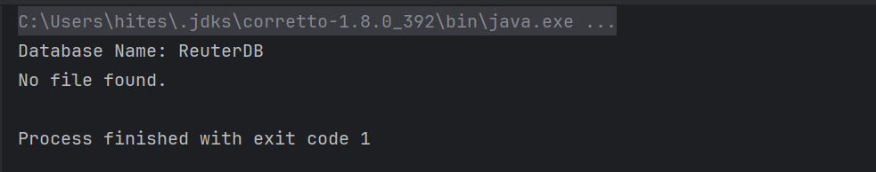

# SparkInsights: Big Data Analytics Tool

**SparkInsights** is a powerful big data analytics tool designed to filter out unwanted symbols and characters from news articles. Leveraging Google Cloud Platform (GCP) with Dataproc, Apache Spark, and Hadoop, SparkInsights ensures efficient processing and analysis of large datasets, enhancing the quality and relevance of extracted insights.
SparkInsights is a big data analytic tool that filters unwanted symbols and characters from the news using GCP Dataproca, Apache Spark and Hadoop.

# Table of Contents 

* [Problem - 1A](#problem---1a)

* [Problem - 1B](#problem---1b)

* [Problem - 2](#problem---2)

* [References](#references)

# Problem - 1A
Statement:

Reuter News Data Reading & Transformation and storing in MongoDb.

## Solution:

### Flowchart:

### Algorithm:

1.  Connection with MongoDB:

    -   Create connection using mongoDB driver

    -   Read database

2.  Extract, Transform and load:

    -   Read .sgm files

    -   For each file:

        -   Extract Reuter Tags

        -   For Reuter Tag:

            -   Extract News and body content

            -   Remove HTML entities (\"&#3;\", \"&#5;\", \"&lt;\")

            -   Add data to MongoDB

To solve this problem, first I setup local mongoDB as shown in the lab.
By doing this, it helped me to debug the program fast and easily.
Once,program compiled successfully I setup cloud ATLAS mongoDB \[12\].

Also, I have used maven build platform to setup MongoDB and Apache
Spark.

To setup local connection, I first:

-   Installed mongoDB and setup it machine and

-   Installed mongoDB compass for better visualization of the data

ATLAS MongoDB:

-   Setup ATLAS account

-   Created new cluster

-   Created Database "ReuterDB" and collection "ReuterNewsColletion" in
    it.

-   Generated Username and password.

Code starts with calling start() method, which sequentially calls other
methods.

### Explanation:

### Connection with MongoDB \[12\]:

Initially, I build connection with the mongoDB. For this, I am calling
*makeConnection* which returns mongoDB connection object \[12\].

And, after connection, I am reading the database with the help of
*readDatabase()* method so that I can store data inside it.

### Reuter News Data Reading & Transformation:

Reuter data's loading and transformation starts by calling
*insertInDb()* method. This method iterates through each .sgm file.

Here, I make the dynamic program which each .sgm file instead of being
dependent on static filename. I have implemented *readReuterFile()* to
read .sgm file.

After reading the file with *readReuterFile()* method, it calls
*extractNews()* method.

Here, I am performing following task:

-   Extracting each Reuters tags and storing them in news array

-   Looping through each reuters and extracting title and body tag
    content. For this, I have created separate method called
    *extractTextBetweenTags().*

-   In *extractTextBetweenTags()* method, I am simply extracting text by
    index.

-   After extracting, content is feed into *filterText()* method, where
    I am removing HTML entities such as \"&#3;\", \"&#5;\", \"&lt;\",
    etc along with HTML tags and special symbols such as ",.\<\>. This
    cleans up the tile and content which can be readable to the user.

-   After extracting news and body, I am passing them to
    *addDataToMongoDB()* method where, I can inserting it to MongoDB by
    calling in-build method insertOne() of mongoDB.

### Output/Test cases:

1.  **If credentials of user and all files are present, the code will
    run.**

-   Program run successfully and inserts data in mongoDB.

2.  **If no reuter file, then code will through "No file found" error.**

    -   Program handles if no file found

3.  **If Credentials of MongoDB is incorrect, then code will handle it
    through this error.**

    -   This will restricts user to begin further.

    -   It shows message that this is error in authentication.

    -   This message can be further explained and can be handled if the
        username is incorrect or password is incorrect.

# Problem - 1B:

Reuter News Data Processing using Spark.

## Solution:

### Configure GCP cloud instance and initialize Apache Spark cluster

### Flowchart:

### Explanation:

To start GCP instance for apache hadoop-spark cluster \[11\], I selected
Dataproc option shown in Figure: 13. After this, I selected "Create
Cluster", and selected *Cluster on* *Compute Engine infrastructure*.

Afterwards, I created cluster, by naming it "b00954481-assignment-2". As
taught in the lab, I have selected n2-standard-2 dropdown option for
manager and worker node. This helps to save cost on GCP as we are not
having heaving task to do. We can select cluster configuration as per
our requirements.

After clicking "Create" button, it takes couple of minutes to start
cluster instance. Once, cluster is on, I open the SSH in-browser
terminal from manager node. This is shown in Figure 14, 15, 16, 17, 18
and 19.

Next, I uploaded the jar files which I locally generated along with
supported file such as cleaned-reut2-009.sgm. Here, I created new
directory and added "cleaned-reut2-009.sgm" file in the Hadoop
directory. For this I used following command:

*hadoop fs -put cleaned-reut2-009.sgm /user/hiteshgupta2198*

To see files in Hadoop directory: *hadoop fs -ls* command is used.

Then I run spark system with this command: *spark-submit
B00954481_Assignment-2.jar*

Program run successfully, and it generates the new file as output named:
*wordFrequencies.txt.* This files stores all words with their count.
This process is shown in Figure: 20, 21, 22, 23 and 24.

### Spark Frequency Count:

I have used JavaRDD collection of apache spark library to find word
frequency.

### Flowchart:

### Algorithm:

1.  Generate cleaned reut-009.sgm file.

    -   Remove HTML tags, special symbols and stop words

    -   Save it to new file

2.  Initialize spark application

    -   Configure spark

    -   Create java spark context

3.  Read input file

    -   Read filtered input file

4.  FlapMap to extract words

    -   Convert each line into tokens (words) and store them in JavaRDD
        collection

5.  Map words to count

    -   Map each word with integer count

6.  Reduce

    -   Apply reduce operation to sum all words count

7.  Collect and print details

8.  Stop spark context

### Explanation:

To count the frequency of each word, I followed below steps:

1.  I cleaned up the file named "reut2-009.sgm".

    -   I removed all stop words from the file.

    -   Then, removed HTML tags followed by special symbols.

    -   Then I saved the filtered content in the new file named
        "cleaned-reut2-009.sgm"

2.  Initialized the apache spark object \[4\]:

    -   To setup the apache spark in java with Maven setup, I took
        reference from the apache spark introduction tutorial with RDD
        named "RDD Programming Guide"\[4\].

    -   To setup spark, I created object of *SparkConf()* and setting
        local setup \[4\].

    -   After this, I am creating object *sc* of *JavaSparkContext()*
        through which I performed operations \[4\].

3.  Word Count:

    -   Firstly, I am reading the file with the help of sc.textFile()
        method. Here, content are read by line by line. Each line are
        stored in JavaRDD Collection object of String type. Here,
        JavaRDD collection provide us a mechanism of parallel
        processing. Hence, it process the file parallely and faster.

    -   Then, I am converting each line to individual words knows as
        tokens. And again Storing them in JavaRDD Collection object of
        String type.

    -   Later, I am using *mapToPair()* method of the JavaRDD to map
        each word with its occurring. I have used lambda function that
        takes a word as input and produces a new element in the form of
        a key-value pair *(Tuple2\<String, Integer\>).* For each word,
        it creates a tuple where the word is the key, and the value
        is 1. And, hence storing them in JavaPairRDD\<String, Integer\>
        wordCounts variable.

    -   To transform the wordCounts in order to generate final output, I
        have applied *reduceByKey()* method. I have passed lambda
        *function ((a, b) -\> a+b)* which is further refactor to
        *Integer::sum*, which is more concise way to represent it using
        core Java libraries. This lambda is used to perform a reduction
        on the values of each key. This gives final output of word
        frequency in *JavaPairRDD\<String, Integer\> wordFrequencies*
        variable.

4.  Save result:

    -   Now, as I have wordcount, I need to store it file. For this, I
        can mapping JavaRDD tuples to *List\<Tuple2\<String, Integer\>\>
        result* using *collect()* method.

    -   Calling *saveResultsToFile(results)* to save results in txt file
        named "*wordFrequencies.txt*"

5.  Display Minimum and Maximum word count:

    -   In order to find minimum word count, I am calling the
        *findMinCountWord()* method and passing results inside it. With
        the help of inbuild Java libraries such as *Collections.min()*
        and *Comparator.comparing()*, I am finding the minimum word of
        the lowest count.

    -   There are more than words that have count of 1. Hence, showing
        first word as output.

    -   Similarly, for the maximum word count, I calling the
        findMaxCountWord() method and passing results inside it. Here, I
        am using *Collections.max()* and *Comparator.comparing()*

    -   And, printing the respective count with the help of
        *System.out.println()*.

6.  Stopping JavaSparkContext:

    -   After completion, I am halting JavaSparkContext object.

### Output/Test cases:

  ------------------------------------------------------------------------
  Word                     Criteria                Count
  ------------------------ ----------------------- -----------------------
  BC-MACK-TRUCKS-MACK-DE   Minimum                 1

  mln                      Maximum                 1214
  ------------------------------------------------------------------------

  : []**Figure 1:** Flowchart

1.  **If code run successfully, then it will produce wordFrequencies.txt
    file**

    -   This ensures that code is running as expected both in local and
        on GCP cloud instance.

2.  **WordFrequencies.txt file generated to overcome error.**

    -   Here, we can see that wordFrequencies.txt file is successfully
        to add data.

    -   This also ensures that code is working as expected and storing
        data for future analysis.

3.  **If no cleaned-reut file.sgm provide, then it will generate error
    and exit program**

    -   If cleaned-reut is not provided, then code wil restrict user to
        go further.

    -   This inform user that main input file is missing which need to
        be solve.

4.  **If destination file "wordFrequencies.txt" is not created by the
    user, then program will automatically creates new file and store
    data in them.**

    -   

We can see this in project directory image shown below.

# Problem - 2

Sentiment Analysis using BOW model on title of Reuters News Articles

## Solution

### Flowchart

### Algorithm

1.  Read positive and negative words and storing them in list of String.

2.  Iterate through each Reuter file

3.  Create bag of words

    -   Split title into words

    -   Update bagOfWords

4.  Get sentiment

    -   For each title:

        -   Compare titleWords with positive and negative words

        -   Increment wither positiveWord or negativeWord counter

        -   Examine polarity based on score

        -   If the score is greater than 0:

            -   Return Positive polarity.

        -   If the score is less than 0:

            -   Return Negative polarity.

        -   If the score is 0:

            -   Return Neutral polarity.

5.  Print data

    -   Print header

    -   Print subsequent data in table form

6.  Analyse sentiment

    -   Print the total number of positive, negative, and neutral news.

    -   Calculate and print the percentage of positive, negative, and
        neutral news.

### Explanation

To analysis the sentiment using bag of words model, I have extracted
title and body from the *.sgm* files and process them. Following are the
steps:

1.  Read Negative and Positive words

    -   I read positive and negative words from the assets folder. I
        have taken these files from mkulakowski2 user from GitHub
        \[9\]\[10\].

    -   I stored them in list of strings named positiveWords and
        negativeWords

2.  Iterating through each Reuter files and titles

    -   Here, I am using two for loops, first will loop through each
        reuter file and second will iterate through each title

    -   Here, I am extracting titles from each reuter from
        *extractTitle()* method.

3.  Bag of words

    -   For each title, I am creating bag of words from
        *createBagOfWords()* method.

    -   Here, I am splitting title from space and storing them in list
        of strings.

    -   And, looping through each word, I am calculating word cound and
        storing them in *Map\<String, Integer\> bagOfWords.*

    -   Here, I am *getOrDefault()* method of Map collection to handle
        count of words.

    -   After that, I am printing Title and BOW.

4.  Get Sentiment

    -   After bag of word, I am sending the title to *getSentiment()*
        method for analysing title.

    -   Here, I am iterating each word of title and matching it with
        positive words and negative words in a for loop.

    -   If we found match, then I am increment positivePolarity or
        negativePolarity based on condition.

    -   Final score will be calculated by subtracting negativePolarity
        from positivePolarity.

    -   To determine polarity, I have created *getPolarity()* method.

    -   If score is greater than 0, it's a Positive polarity

    -   If score is less than 0, it's a Negative polarity

    -   If score is 0, it's a Neutral polarity

5.  Print data in table

    -   Once data is ready, I am printing them in tabular format

    -   Here, I have maintain three methods: *printHeader()*,
        *printData()* and *splitTitle()* and I am using printf() method
        of the java. It helps us to print data in tabular format. I have
        learned about this from one blog from *theserverside* \[8\].

    -   To separate rows, I have used dashes (\-\-\--), and for column
        separation, I\'ve used vertical bars (\|).

    -   The *printHeader()* prints the header and columns of the table.
        In order to bring title in centre, I have applied padding before
        and after the title using space. This is possible via "%s".

    -   The *printData()* method prints actual data of the table. It
        takes String title, int positiveScore, int negativeScore, int
        totalScore, String matchedWords, String polarity, int
        newsCounter are arguments.

    -   Here, the title and matched words can be longer. So I have taken
        upper limits for characters.

    -   Here, I am taking care of long title. If the title is too long,
        then it will alter the format of the table and it won't look
        good.

    -   Hence, to take care of it, I have created another method called
        *splitTitle()*.

    -   The *splitTitle()* method will determine either title needs to
        be divided into halves of not. This decision is based on the
        length of the title character.

    -   If the title character count exceeds 50, the title will be split
        into two halves; otherwise, no division will occur.

    -   If the title exceeds 50 characters, I check whether there are
        any spaces in the title. If spaces exist, I divide it from the
        middle space; otherwise, I split it from the exact centre. This
        condition take care that the title remains meaningful even when
        divided into two parts.

    -   Here, I am using static variable called *newsCounter()* to keep
        track of the number of titles encountered.

6.  Write data to csv

    -   After printing, I am writing result to csv file using
        *createCSVFile()* (for creating header) and *writeDataToCSV()*
        to append data to csv file.

7.  Termination of program

    -   After analysing the news, I am drawing the conclusion based on
        the processing. Like, number of positive news, negative news and
        neutral; both counting and percentage.

    -   Once, both Reuter files are analysed, then program will stop.

### Output/Test cases:

1.  **The code has analysed 1694 news.**

    -   Out of which 233 were positive, 256 were negative and rest were
        neutral news.

> {width="6.282221128608924in"
> height="2.942858705161855in"}

2.  **If no positive file found then, it will print the error message.**

    -   If no positive word file found, then code will inform this to
        user and stop the program.

3.  **If no negative file found, then it will print error message**

    -   If no negative word file found, then code will inform this to
        user and stop the program.

**\
**

4.  **I am storing sentiment data in csv file.**

-   If csv file is not created by the user, then code will automatically
    create the new one to by-pass the error. We can see this in project
    structure shown below.

# References

\[1\] Dalhousie University, \"University Logo,\" Dalhousie University
Official Website, 2023. \[Online\]. Available: https://www.dal.ca/.
\[Accessed on: Nov. 01, 2023\].

\[2\] Draw.io, \"Platform,\" Draw.io Official Website, 2023. \[Online\].
Available: https://www.draw.io. \[Accessed on: Nov. 01, 2023\].

\[3\] Apache Software Foundation. \"Apache Spark - Unified Analytics
Engine for Big Data.\" Apache Software Foundation. \[Online\].
Available: <https://spark.apache.org/>

\[4\] Apache Spark, \"RDD Programming Guide,\" Apache Spark
Documentation, 2022. \[Online\]. Available:
<https://spark.apache.org/docs/latest/rdd-programming-guide.html>

\[5\] Apache Spark, \"Apache Spark Documentation,\" 2.4.0 Edition, 2019.
\[Online\]. Available: <https://spark.apache.org/docs/2.4.0/> \[Accessed
on: Nov. 26, 2023\].

\[6\] Apache Spark, \"Getting Started - Spark SQL,\" Apache Spark
Documentation, 2.4.0 Edition, 2019. \[Online\]. Available:
<https://spark.apache.org/docs/2.4.0/sql-getting-started.html>
\[Accessed on: Nov. 26, 2023\].

\[7\] MongoDB, \"MongoDB - The database for modern applications,\"
MongoDB, Inc. \[Online\]. Available: <https://www.mongodb.com/>
\[Accessed on: Nov. 26, 2023\].

\[8\] TheServerSide. \"How to use Java printf to format output.\"
TheServerSide.com, 27 January 2020,
<https://www.theserverside.com/blog/Coffee-Talk-Java-News-Stories-and-Opinions/How-to-use-Java-printf-to-format-output>.
\[Accessed on: Nov. 26, 2023\].

\[9\] Marcuin Kulakowski. \"List of Negative Words.\" GitHub Gist, 2012,
<https://gist.github.com/mkulakowski2/4289441>. \[Accessed on: Nov. 26,
2023\].

\[10\] Marcuin Kulakowski. \"List of Positive Words.\" GitHub Gist,
2012, <https://gist.github.com/mkulakowski2/4289437>. \[Accessed on:
Nov. 26, 2023\].

\[11\] Google Cloud Platform. \"Google Cloud Platform - Build, Deploy &
Scale Applications.\" Google. \[Online\]. Available:
<https://cloud.google.com/>.\[ Accessed: November 27, 2023\].

\[12\] MongoDB. \"MongoDB Cloud - Overview.\" MongoDB Cloud, MongoDB,
Inc., https://cloud.mongodb.com/v2/654a7afd3aece92e115a9b56#/overview,
\[Accessed: Nov. 27, 2023\].
